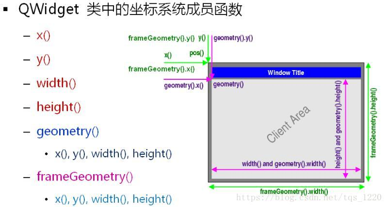

# Qwidget

Qwidget 是所有 ui 组件的基类, 其父类为 `QObject`

## 坐标系统位置



## 改变大小

void resize(QSize)

void resize(w:int, h:int)

## 改变位置

move(int x, int y)

move (QPoint)

## 设置组件的样式

setWindowFlag(WindowType, on: bool = True)

## 设置固定大小

1. setFixedSize()

## 设置

## 设置样式

查看支持的默认样式


```python
from PyQt5.QtWidgets import QApplication, QWidget, QStyleFactory

# 查看支持的默认样式
support = QStyleFactory.keys()
QApplication(support[0])

```


## 


## 外观

边距（Margins） 设置 setContentsMargins(int , int , int , int )

## 布局

延伸(Stretch) 组件占用的空间 setStretch, setColumnStretch, setRowStretch, setStretchFactor
控件间隔(Spacing) setSpacing()

## 属性
    setWindowFlag(属性)
    1. QtCore.Qt.FramelessWindowHint  无边框


    .setWindowOpacity(0.9)  # 设置窗口透明度

    .setAttribute(QtCore.Qt.WA_TranslucentBackground)  # 设置窗口背景透明

## 属性和特性

### setWindowOpacity( level:foalt )
设置透明度

### 设置组件属性
setAttribute()
属性
QtCore.Qt.WA_TranslucentBackground 设置窗口背景透明

### 设置组件Flags

1. setWindowFlag()

2. setWindowFlags()


falas:
Qt.Qt.FramelessWindowHint 去掉标题
Qt.Qt.WindowStaysOnTopHint 去掉任务栏显示
Qt.Qt.WindowStaysOnTopHint 窗口置顶
