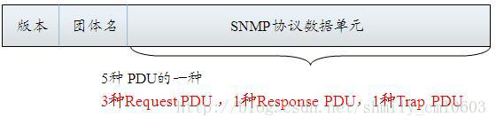

# SNMP服务搭建
## snmap 简介

>  SNMP中定义了五种通信消息类型：Get-Request、Get-Response、Get-Next-Request、Set-Request、Trap

>  SNMP返回数据类型
1. 通用类型
2. 通用结构类型
3. 应用类型

### SNMP协议数据单元
1. snmpv1


### SNMP认证方式
1. v1,v2 通过团体字
2. V3 分三种认证级别
> * noAuthNoPriv（不认证也不加密）
> * 2.authNoPriv（认证但是不加密）
> * 3.authPriv（既认证又加密）

#### 认证时需要的参数

| 参数 | 说明 |
| :---- | :----|
| ttlsa | 用户名 |
| ttlsapwd|密码，密码必须大于8个字符 |
| DES |	加密方式，这边支持AES、DES两种|
| ttlsades | DES口令，必须大于8位|
### 操作类型 
## 服务器软件：

1. snmpd http://net-snmp.sourceforge.net/
>  支持 SNMP v1, SNMP v2c and SNMP v3

## 安装

  apt-get install snmpd #snmp服务器
	apt-get install snmp #客户端
	apt-get install libsnmp-dev #配置命令

## snmpd 的配置
配置文件在 `/etc/snmp/snmpd.conf`
### 配置监听地址
| 配置参数 | 监听地址 |
| --- | ---|
| agentAddress |  [udp \| tcp] :0.0.0.0:161 |
### 警告
| 配置参数 | 参数 | 参数 |
| ---- | ----- | ---- |
|  trapsink  | localhost | public |
|  trap2sink | localhost | public |
| informsink | localhost | public |

### 访问权限


### 配置v3权限
#### authPriv
```bash
net-snmp-create-v3-user -ro -a SHA -A mypass123 -x DES -X mydes123 snmptest
```
测试命令：
``` bash
snmpwalk -v 3 -u snmptest -a SHA -A mypass123 -x DES -X mydes123 -l authPriv 192.168.151.99 ".1.3.6.1.4.
1.2021.11.10.0"
```
### authNoPriv
```bash
net-snmp-create-v3-user -ro -a SHA -A mypass123 authtest
```
测试命令：
```bash
snmpwalk -v 3 -u authtest -a SHA -A mypass123  -l authNoPriv 192.168.151.99 .1.3.6.1.4.1.2021.4.6.0
```
### noAuthNoPriv

net-snmp-create-v3-user -ro noauthtest

测试命令：
```bash
snmpwalk -v 3 -u noauthtest -l noAuthNoPriv 192.168.151.99 .1.3.6.1.4.1.2021.4.6.0
```


## 常用的OID 
SNMP OID列表 监控需要用到的OID

http://www.ttlsa.com/monitor/snmp-oid/


