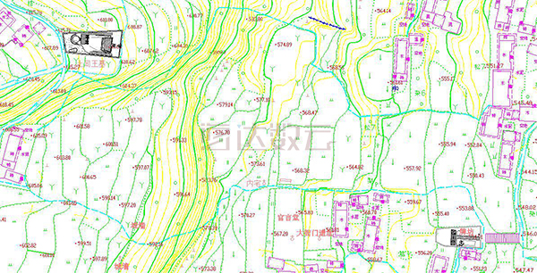
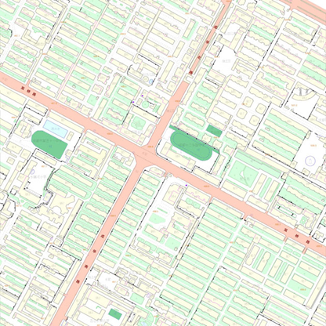
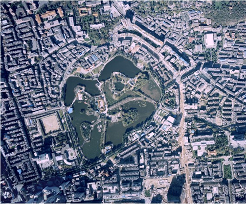
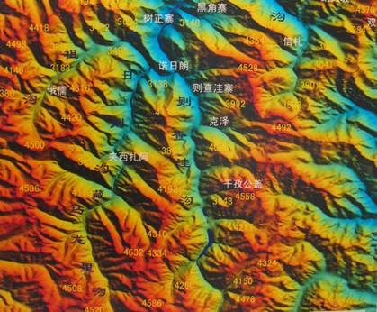

# 地理信息系统
地理信息系统（Geographic Information System或 Geo－Information system，GIS）有时又称为“地学信息系统”。它是一种特定的十分重要的空间信息系统。它是在计算机硬、软件系统支持下，对整个或部分地球表层（包括大气层）空间中的有关地理分布数据进行采集、储存、管理、运算、分析、显示和描述的技术系统。和维护性。

常见类型
- WebGIS
- MoblieGIS
- GIS System Platform （军事、专业桌面程序等）

GIS的功能

定位、导航、跟踪、轨迹、规划等

GIS的用途

农业、林业、国土资源、地矿、军事、交通、测绘、水利、广播电视、通讯、电力、公安、社区管理、教育、能源等

## 地图分类

- 按照比例尺大小

  1. 大比例尺地形图：1：5千—1：2.5万比例尺地形图 （1cm：5k cm — 1cm：25k cm）
  
  2. 中比例尺地形图：1：5万—1：25 万比例尺地形图
  
  3. 小比例尺地形图：1：50万-1：100万比例尺地形图
  
  4. 我国称1：1万、1：2.5万、1：5万、1：10万、1：25万、1：50万、1：100万七种比例尺普通地图为国家基本比例尺地形图

- 按照用途
  1. 参考图
  2. 教学图
  3. 地形图
  4. 航空图
  5. 海图
  6. 海岸图
  7. 天文图
  8. 交通图
  9. 旅游图

- 按照制图区域范围
  1. 世界图
  2. 半球图
  3. 大洲图
  4. 大洋图
  5. 大海图
  6. 国家（地区）图
  7. 省区图
  8. 市县图
  9. 乡镇图等

- 数据类型
  1. 数字线划图（DLG）

      数字线划地图(DLG, Digital Line Graphic)：是与现有线划基本一致的各地图要素的矢量 数据集，且保存各要素间的空间关系和相关的属性信息。

      
    
  2. 数字栅格图（DRG）

      

  3. 数字正射影象图（DOQ）

      

  4. 数字高程模型（DEM）

      

- 实现方式

  1. 瓦片地图

      由一张一张的正方形小图片拼接成的地图。

  2. 矢量地图 

      根据矢量数据，绘制出来的地图。

  

