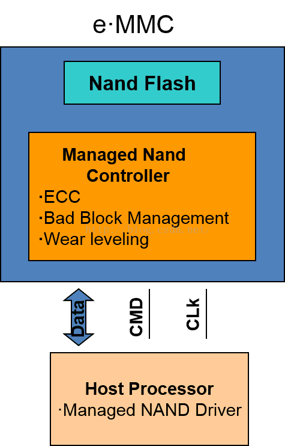

# emmc

  eMMC (Embedded Multi Media Card) 采用统一的MMC标准接口， 把高密度NANDFlash以及MMCController封装在一颗BGA芯片中。针对Flash的特性，产品内部已经包含了Flash管理技术，包括错误探测和纠正，flash平均擦写，坏块管理，掉电保护等技术

  

  
  

---  

## 读取速度：

1. eMMC4.4 104MB/s

2. eMMC4.5 200MB/s

3. eMMC5.0 400MB/s 

> 因为使用的是8位并行界面，因此 eMMC5.0 性能潜力已经基本到达瓶颈,替换产品为 UFS(通用flash储存标准)

---

## EMMC 标准分区

eMMC 标准中，将内部的 Flash Memory 划分为 4 类区域，最多可以支持 8 个硬件分区，如下图所示

一般情况下，Boot Area Partitions 和 RPMB Partition 的容量大小通常都为 4MB，部分芯片厂家也会提供配置的机会。General Purpose Partitions (GPP) 则在出厂时默认不被支持，即不存在这些分区，需要用户主动使能，并配置其所要使用的 GPP 的容量大小，GPP 的数量可以为 1 - 4 个，各个 GPP 的容量大小可以不一样。User Data Area (UDA) 的容量大小则为总容量大小减去其他分区所占用的容量。

---

### 分区编址
eMMC 的每一个硬件分区的存储空间都是独立编址的，即访问地址为 0 - partition size。具体的数据读写操作实际访问哪一个硬件分区，是由 eMMC 的 Extended CSD register 的 PARTITION_CONFIG Field 中 的 Bit[2:0]: PARTITION_ACCESS 决定的，用户可以通过配置 PARTITION_ACCESS 来切换硬件分区的访问。也就是说，用户在访问特定的分区前，需要先发送命令，配置 PARTITION_ACCESS，然后再发送相关的数据访问请求。更多数据读写相关的细节，请参考 eMMC 总线协议 章节。

eMMC 的各个硬件分区有其自身的功能特性，多分区的设计，为不同的应用场景提供了便利

---
## Boot Area Partitions

Boot Area 包含两个 Boot Area Partitions，主要用于存储 Bootloader，支持 SOC 从 eMMC 启动系统。

## 参考

1. http://www.wowotech.net/basic_tech/emmc_partitions.html

2. https://blog.csdn.net/u014645605/article/details/52061034

