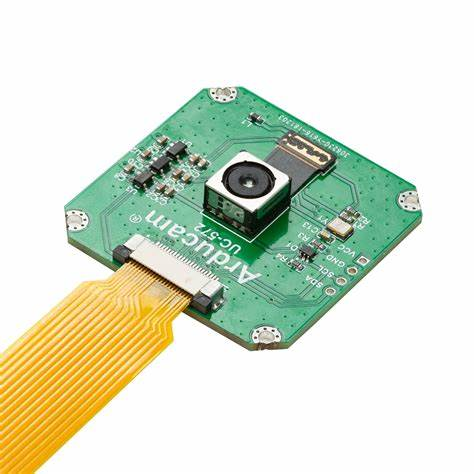
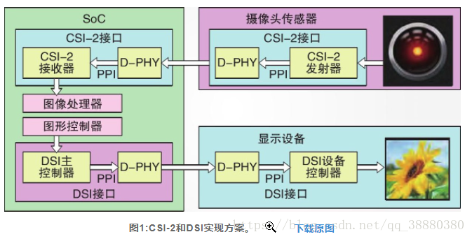

##  MIPI摄像头

    

  MIPI联盟的全称为 `Mobile Industry Processor Interface Alliance`（移动产业处理器接口联盟），它是由移动通讯和娱乐电子产品行业中的应用或硬件制造商组建而成的行业联盟。

  MIPI 联盟旨在推进移动应用处理器接口的标准化。MIPI 联盟下面有不同的 WorkGroup ，分别定义了一系列的手机内部接口标准，比如摄像头接口 CSI 、显示接口 DSI 、射频接口 DigRF 、麦克风/喇叭接口 SLIMbus 等。而 MIPI CSI-2 (Camera) and MIPI DSI (Display)则是目前业界使用最广的两个 MIPI 接口标准，而这也是和视频传输相关的标准。

  MIPI摄像头在其他嵌入式产品中，比如行车记录仪、执法仪、高清微型相机、网络监控相机等得到广泛应用。

  按照协议可以分为DSI和CSI-2两种接口。

  

参考：

  * https://zhuanlan.zhihu.com/p/146572204

  * https://zhuanlan.zhihu.com/p/92682047

---

## IPC网络摄像头

### 网络摄像头行业标准:

  1. ONVIF标准
      
      ONVIF原意为开放型网络视频接口论坛，即Open Network Video Interface Forum；是安讯士、博世、索尼等多家公司在2008年共同成立的一个国际性开放型网络视频产品标准网络接口的开发论坛，后来由这个技术开发论坛共同制定的开放性行业标准，习惯性简称为ONVIF协议。

  2. PSIA标准

      PSIA (Physical Security Interoperability Alliance)物理实体安防互操作性联盟，是一个由65个以上的安防厂商和系统集成商组成的全球性联盟，致力推动整个安防生态系统及以后的IP功能的安全设备和系统的互操作性，

  3. HDCCTV标准

      HDcctv系统是一种视频监控系统，与广播行业兼容的高清晰度(HDTV)视频信号可以经由传统的CCTV媒介进行数字化传输而不需要打包，并且不会出现人眼可感知的压缩延迟。在HDcctv中的串行数字传输链路是从为专业广播市场开发的SDI基本技术派生而来的。

  4. GB/T28181标准

      GB/T28181-2011 《安全防范视频监控联网系统信息传输、交换、控制技术要求》是由公安部科技信息化局提出，由全国安全防范报警系统标准化技术委员会（SAC/TC100)归口，公安部一所等多家单位共同起草的一部国家标准。

### 流媒体传输协议:

- RTP

- RTCP

- RTSP

- RSVP

- RTMP/RTMPS

- MMS

- HTTP Live Streaming(HLS)

 

